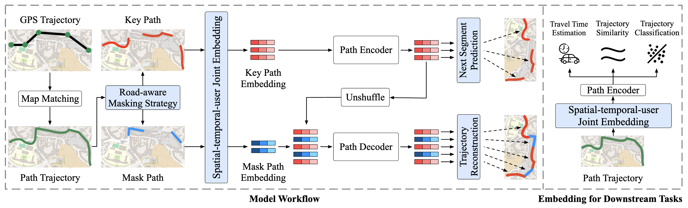

# RED: Effective Trajectory Representation Learning with Comprehensive Information

**[VLDB2025]** The pytorch implementation of accepted paper "RED: Effective Trajectory Representation Learning with Comprehensive Information"

## Framework
<div align=center>

</div>

## Environment Requirements

RED is based on Python version 3.10 and PyTorch version 2.0.1. Please make sure you have installed Python and PyTorch correctly. Then you can install other dependencies as follows:

*matplotlib*==3.8.1

*networkx*==3.2.1

*numpy*==2.0.0

*pandas*==2.2.2

*scikit_learn*==1.3.0

*scipy*==1.14.0

*Shapely*==2.0.5

*timm*==0.9.8

*torch*==2.0.1

*torch_geometric*==2.3.1

*tqdm*==4.66.1

*transformers*==4.33.1

*loguru*==0.7.2


## DATA

We conduct our experiments on three trajectory datasets and corresponding road networks, including **Chengdu**, **Porto** and **Rome**. Due to privacy, we only provide Porto dataset ([Google driver](https://drive.google.com/file/d/1hJjRv2D0hhpOPfIy7C9cqXxkp8WwxY4z/view?usp=drive_link)). To get path trajectory, you can refer to map matching method [FMM](https://github.com/cyang-kth/fmm). To get trajectory similarity, you can refer to this [website](https://github.com/bguillouet/traj-dist). To get detour trajectory, you can refer to [JCLRNT](https://github.com/mzy94/JCLRNT). 

For exmaple:

- `./data/porto/rn/...` is the road network data.

- `./data/porto/traj/...` is the trajectory data.

- `./data/porto/...` is the pre-processed data used for training and downstream tasks. After map matching [FMM](https://github.com/cyang-kth/fmm), you can run `./utils/road_aware_masking.py` to get road-aware-mask.

## Pre-Train

You can pre-train **RED** through the following commands：

```shell
# Porto
python main.py --exp_id <set_exp_id> --dataset porto --device 0 --lr 1e-4 --batch_size 64 --epochs 10 --g_depths 3 --g_heads_per_layer [8,16,1] --g_dim_per_layer [16,16,128] --g_dropout 0.1 --enc_embed_dim 128 --enc_ffn_dim 512 --enc_depths 6 --enc_num_heads 8 --enc_emb_dropout 0.1 --enc_tfm_dropout 0.1 --dec_embed_dim 128 --dec_ffn_dim 512 --dec_depths 6 --dec_num_heads 8 --dec_emb_dropout 0.1 --dec_tfm_dropout 0.1 --lambda1 0.1 --lambda2 0.5

# Chengdu 
python main.py --exp_id <set_exp_id> --dataset cd --device 0 --lr 1e-4 --batch_size 32 --epochs 5 --g_depths 3 --g_heads_per_layer [8,16,1] --g_dim_per_layer [16,16,128] --g_dropout 0.1 --enc_embed_dim 128 --enc_ffn_dim 512 --enc_depths 6 --enc_num_heads 8 --enc_emb_dropout 0.1 --enc_tfm_dropout 0.1 --dec_embed_dim 128 --dec_ffn_dim 512 --dec_depths 6 --dec_num_heads 8 --dec_emb_dropout 0.1 --dec_tfm_dropout 0.1 --lambda1 0.1 --lambda2 0.5

# Rome
python main.py --exp_id <set_exp_id> --dataset rome --device 0 --lr 2e-4 --batch_size 32 --epochs 30 --g_depths 3 --g_heads_per_layer [8,16,1] --g_dim_per_layer [16,16,128] --g_dropout 0.1 --enc_embed_dim 128 --enc_ffn_dim 512 --enc_depths 6 --enc_num_heads 8 --enc_emb_dropout 0.1 --enc_tfm_dropout 0.1 --dec_embed_dim 128 --dec_ffn_dim 512 --dec_depths 6 --dec_num_heads 8 --dec_emb_dropout 0.1 --dec_tfm_dropout 0.1 --lambda1 0.1 --lambda2 0.5
```

 ## Fine-tune

We can fine-tune the model for downstream tasks. Note that you need to modify the `exp_id` field in the following command.

(1) Travel Time Estimation

```shell
# Porto
python eta_task.py --exp_id <same as pretraining> --dataset porto --gpu_id 0 --lr 1e-4 --batch_size 64 --epochs 30

# Chengdu
python eta_task.py --exp_id <same as pretraining> --dataset cd --gpu_id 0 --lr 1e-4 --batch_size 64 --epochs 30

# Rome
python eta_task.py --exp_id <same as pretraining> --dataset rome --gpu_id 0 --lr 1e-4 --batch_size 64 --epochs 30
```

(2) Trajectory Classification

```shell
# Porto
python cls_task.py --exp_id <same as pretraining> --dataset porto --gpu_id 0 --lr 1e-4 --batch_size 64 --epochs 30

# Chengdu
python cls_task.py --exp_id <same as pretraining> --dataset cd --gpu_id 0 --lr 1e-4 --batch_size 64 --epochs 30

# Rome
python cls_task.py --exp_id <same as pretraining> --dataset rome --gpu_id 0 --lr 1e-4 --batch_size 64 --epochs 30
```

(3) Trajectory Similarity Computation

```shell
# Porto
python sim_task.py --exp_id <same as pretraining> --dataset porto --gpu_id 0

# Chengdu
python sim_task.py --exp_id <same as pretraining> --dataset cd --gpu_id 0

# Rome
python sim_task.py --exp_id <same as pretraining> --dataset rome --gpu_id 0
```

(4) Most Similar Trajectory Search

```shell
# Porto
python most_sim_task.py --exp_id <same as pretraining> --dataset porto --gpu_id 0

# Chengdu
python most_sim_task.py --exp_id <same as pretraining> --dataset cd --gpu_id 0

# Rome
python most_sim_task.py --exp_id <same as pretraining> --dataset rome --gpu_id 0
```

### Cite

If you find the paper useful, please cite our paper. ^_^

```
@article{zhou2024red,
  title={RED: Effective Trajectory Representation Learning with Comprehensive Information},
  author={Zhou, Silin and Shang, Shuo and Chen, Lisi and Jensen, Christian S and Kalnis, Panos},
  journal={arXiv preprint arXiv:2411.15096},
  year={2024}
}
```
